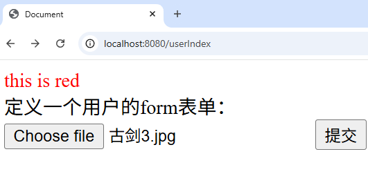
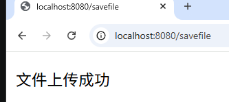
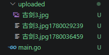

# form 表单

## 单个文件
### 【1】代码：
#### backend
```Go
func main() {
	r := gin.Default()
	// 写路由
	// 加载html页面：
	r.LoadHTMLGlob("template/**/*")
	r.Static("/s", "static")

	// 定义路由
	r.GET("/userIndex", myfunc.Hello1)
	r.POST("/savefile", myfunc.Hello2)
	r.Run()
}
func Hello2(c *gin.Context) {
	// 获取前端传入的文件
	file, err := c.FormFile("myfile") // 这里的"myfile"是前端上传文件时<input>的name
	if err != nil {
		fmt.Println(err)
		return
	}
	fmt.Println(file.Filename)

	// 加入时间戳：
	time_int := time.Now().Unix()               // 获得当前时间int类型 ~1970.01.01.00.00.00 至今GMT
	time_str := strconv.FormatInt(time_int, 10) // 转成字符串,10进制

	// 保存在我的本地
	c.SaveUploadedFile(file, "./uploaded/"+file.Filename+time_str)

	// 响应
	c.String(200, "文件上传成功")

}

```

#### frontend
```HTML
{{define "demo01/hello.html"}}
<!DOCTYPE html>
<html lang="en">
<head>
    <meta charset="UTF-8">
    <meta name="viewport" content="width=device-width, initial-scale=1.0">
    <title>Document</title>
    <link rel="stylesheet" href="/s/css/mycss.css">
</head>
<body>
    <span> this is red </span>
    <br>
    定义一个用户的form表单：
    <form action="/savefile" method="post" enctype="multipart/form-data">
        <input type="file" name="myfile" >
        <input type="submit" value="提交">
    </form> 
</body>
</html>

{{end}}
```


### 【2】注意：在上传文件的时候，在表单中要加入`enctype="multipart/form-data"`
- form表单中的`enctype="multipart/form-data"`什么意思：  
    - `enctype`: encodetype
    - `multiplart/form-data`: 表单数据有多部分构成，既有文本数据也有文件等二进制数据
    - 默认情况下 `enctype` - `application/x-www-form-urlencoded`, 不能用于文件上传，只有用上面那个才能传递完整文件数据
    - `application/x-www-form-urlencoded`: 只能上传文本格式的文件


### 运行结果：


---

## 多个文件

- `c.MultipartForm()`  vs  `c.Request.MultipartForm`   
    - `c.MultipartForm()`: Gin 推荐的安全快捷方式
        - 自动解析：如果之前没有解析过表单，它会自动调用底层方法去解析请求体。
        - 安全性/错误处理：它会返回一个 error。如果客户端发来的不是 multipart 格式，或者传输中断、超出大小限制，你可以立刻捕获到错误。
        - 惯用写法：
        ```Go
        form, err := c.MultipartForm()
        if err != nil {
            c.String(http.StatusBadRequest, "解析表单失败: %s", err.Error())
            return
        }
        // 此时可以安全地使用 form.File 和 form.Value
        ```
    - `c.Request.MultipartForm`: 标准库原生属性  - 这是一个结构体字段（Field），属于 Go 原生 http.Request 的一部分。
        - 没有自动解析：直接读取这个字段不会触发解析。如果在这之前你没有调用过任何解析表单的方法（如 c.SaveUploadedFile、c.FormFile 或 c.MultipartForm()），这个字段的值会是 nil。
        - 无错误返回：因为它只是一个属性，所以无法返回解析时发生的错误。
        - 适用场景：只有当你百分之百确定在此之前 Gin 已经帮你解析过表单了（例如前面已经执行过了相关绑定中间件或文件获取方法），你才能直接读取它。
        ```Go
        // 风险写法：如果前面没解析过，这里 form 是 nil，下一行直接 panic
        form := c.Request.MultipartForm 
        files := form.File["upload"]
        ```
- 【1】代码：
```Go
r.POST("/savefile", myfunc.Hello3)
func Hello3(c *gin.Context) {

	// 1. c.MultipartForm() —— Gin 推荐的安全快捷方式
	form, e := c.MultipartForm()
	if e != nil {
		fmt.Println(e)
		return
	}
	// 在form表单中获取name相同的文件
	files := form.File["myfile"] // File是个map，通过key获取value部分

	// files 就是name相同的多个文件：挨个处理，遍历处理
	for _, file := range files {
		// 获取前端传入的文件
		fmt.Println(file.Filename)

		// 加入时间戳：
		time_int := time.Now().Unix()               // 获得当前时间int类型 ~1970.01.01.00.00.00 至今GMT
		time_str := strconv.FormatInt(time_int, 10) // 转成字符串,10进制

		// 保存在我的本地
		c.SaveUploadedFile(file, "./uploaded/"+time_str+file.Filename)
	}

	// 响应
	c.String(200, "文件上传成功")

}
```

```HTML
<body>
    <span> this is red </span>
    <br>
    定义一个用户的form表单：
    <form action="/savefile" method="post" enctype="multipart/form-data">
        <!-- 如果上传的文件的name是不同的， 后端的处理就是按照c.FormFile方式-->
         <!-- 如果上传的文件的name是相同的，那么后端的处理就要发生变化 -->
        <input type="file" name="myfile" >
        <input type="file" name="myfile" >
        <input type="file" name="myfile" >

        <input type="submit" value="提交">
    </form> 
</body>
```