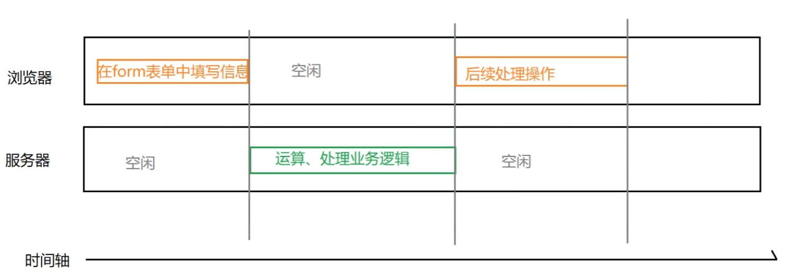
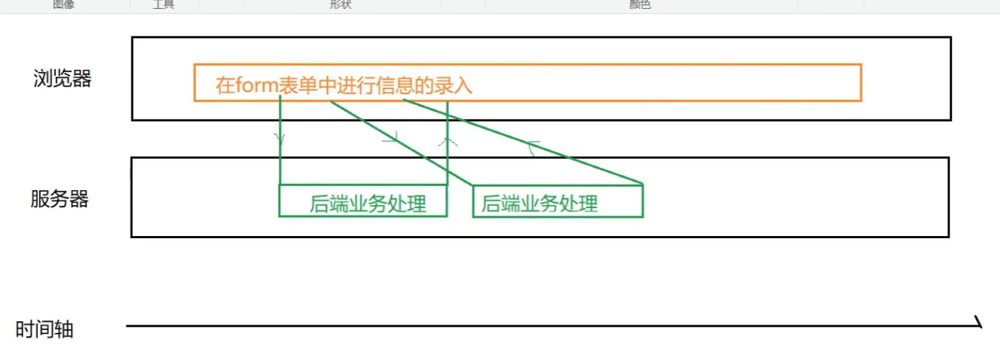
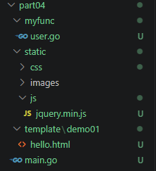
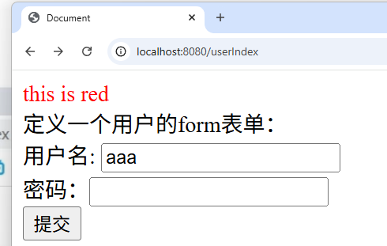
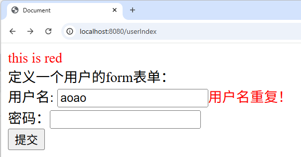

### 什么是同步交互
首先用户向HTTP服务器提交一个处理请求，接着服务器端接收到请求后，按照预先编写好的程序中的业务逻辑进行处理，比如和数据库服务器进行数据信息交换。最后，服务器对请求进行响应，将结果返回给客户端，返回一个html在浏览器中显示，通常会有css样式丰富页面的显示效果   
#### 优点
可以保留浏览器后退按钮的正常功能，在动态更新页面的情况下，用户可以回到前一个页面状态，浏览器能几下历史记录中的静态页面，用户通常都希望单机后退按钮时，就能够取消他们前一次的操作，同步交互可以实现这个需求
#### 缺点
1. 同步交互的不足之处，会给用户一种不连贯的体验，当服务器处理请求的时候，用户只能等待状态，页面中显示的内容只能是空白。   
2. 因为已经条状到新的页面，原本在页面上的信息无法保存，好多信息需要重新填写   
    
PS：浏览器和服务器交替进入工作状态，轮流操作和计算，浏览器访问服务器后，有页面的跳转。从A页面跳转到B页面   
但是在交替工作过程中，无形之中造成了时间的浪费 --- 同步交互方法

### 什么是异步交互
指发送一个请求，不需要等待返回，随时可以再发送下一个请求，既不需要等待。在部分情况下，我们的项目开发中都会优先选择不需要等待的异步交互方式。将用户请求放入消息队列，并反馈给用户，系统迁移程序已经启动，你可以关闭浏览器了。然后程序再慢慢地去写入数据库去。这就是异步。异步不用等所有操作都做完，就响应用户请求。即先响应用户请求，然后慢慢去写数据库，用户体验好
#### 优点：
1. 前端用户操作和后台服务器运算可以同时进行，可以充分利用用户操作的间隔时间完成运算
2. 页面没有跳转，响应回来的数据直接就在原页面上，页面原有信息得以保留
#### 缺点：
可能破坏浏览器后退按钮的正常行为。在动态更新页面的情况下，用户无法回到前一个页面状态，这是因为浏览器仅能记录的始终是当前一个的静态页面。用户通常都希望单击后退按钮，就能取消他们的前一次操作，但是在AJAX这样的异步程序，却无法这样做
    
PS：在操作页面的过程中，就可以向服务器发送格子请求并且可以将信息返回给浏览器，浏览器不出现空闲等待的现象，该工作还是工作，互不影响，效率高 ---> 异步交互方法，可以减少用户花费的时间，提供用户的体验感

PS：并不是有了异步以后所有代码都用异步方法了，异步和同步各有优缺点
---
---

## AJAX
【1】介绍：  
AJAX: Asynchronous Javascript And XML (异步JavaScript和XML)，是指一种创建交互式，快速动态网页应用的网页开发技术，无需重新加载整个网页的情况下，能够更新部分网页的技术。通过在后台与服务器进行少量数据交换，AJAX可以使网页实现异步更新。这意味者可以在不重新加载网页的情况下，对网页的某部分进行更新。
【2】AJAX最大的特点：异步访问，局部刷新
【3】代码：案例：AJAX之验证用户名是否被占用   
构架：   

代码：   
```Go
func main() {
	r := gin.Default()
	// 写路由
	// 加载html页面：
	r.LoadHTMLGlob("template/**/*")
	// 指定js文件 和 css文件
	r.Static("/s", "static")

	// 定义路由
	r.GET("/userIndex", myfunc.Hello1)
	r.POST("/getUserInfo", myfunc.Hello2)
	r.POST("/ajaxpost", myfunc.Hello3)
	r.Run()
}


// ajax后端的处理
func Hello3(c *gin.Context) {
	//获取post-ajax请求的数据，获取对应的数据:
	uname := c.PostForm("uname")
	fmt.Println(uname)
	// 如果获取的数据和“aoao“一样，那么急着前端响应-用户名录入重复
	if uname == "aoao" {
		fmt.Println(uname == "aoao")

		// 向浏览器/前端返回数据，返回json格式
		// mapdata := map[string]interface{}{
		// 	"msg": "用户名重复！",
		// }
		// c.JSON(200, mapdata)
		c.JSON(200, gin.H{
			"msg": "用户名重复！",
		})
	} else {
		c.JSON(200, gin.H{"msg": ""})
	}
}
```
前端：   
```HTML
{{define "demo01/hello.html"}}
<!DOCTYPE html>
<html lang="en">
<head>
    <meta charset="UTF-8">
    <meta name="viewport" content="width=device-width, initial-scale=1.0">
    <title>Document</title>
    <link rel="stylesheet" href="/s/css/mycss.css">
    <!-- 在现代html5里，type可以省略因为浏览器默认script就是js -->
    <script type="text/javascript" src="/s/js/jquery.min.js"></script>


</head>
<body>
    <span> this is red </span>
    <br>
    定义一个用户的form表单：
    <form action="/getUserInfo" method="post">
            <!-- action: 待会提交表单到什么位置  -->
            <!-- method：不写默认是get -->
    
        用户名: <input type="text" name="username" id="uname"><span id="errmsg"></span><br>
        密码：<input type="password" name="pwd"><br>
        <input type="submit" value="提交">
    </form>
    <script>
        // 获取用户名的文本框
        var unametext = document.getElementById("uname");
        // 给文本框绑定一个事件
        // 失去焦点的时候会触发后面的函数的事件
        unametext.onblur = function(){
            // 获取文本框的内容：
            var uname = unametext.value;
        //    alert(uname);// 可以弹出数据，验证代码正确性
          // 局部刷新：通过ajax技术来实现数据的校验 --> 后台：异步访问，局部刷新
          // 调用ajax方法需要传入json格式的数据：$.ajax({属性名：属性值，属性名：属性值，方法名：方法})
          $.ajax({
            url: "/ajaxpost", // 请求路由
            type: "POST", // 请求类型GET，POST
            data: {
                // 向后端发送的数据，以json格式向后端传递
                "uname":uname
            },
            success : function(info){
                // 后台响应成功会调用函数
                // info = 后台响应的数据封装到info里，info名字可以随意
                // alert(info["msg"])
                document.getElementById("errmsg").innerText = info["msg"]

            },
            fail: function(){
                // 后台响应失败会调用函数
            }   
          })
        }

    </script>
</body>
</html>

{{end}}
```
运行结果：  
 