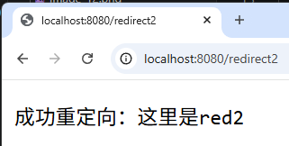
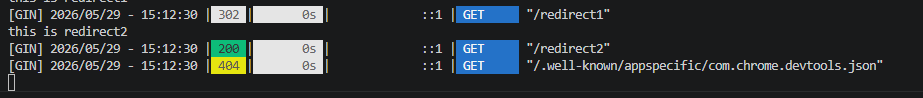
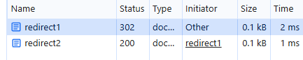
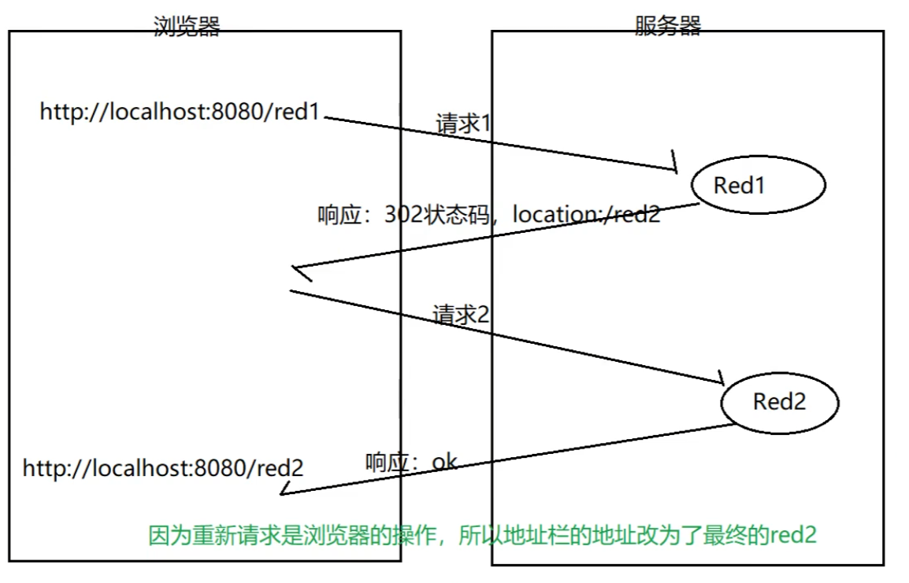

# 响应重定向
生活案例：A找B要钱，B说你找C去，C说你找D去
- 响应重定向时请求服务器后，服务器通知浏览器，让浏览器去自主请求其他资源的一种方式

## 代码
```Go
func main() {
	r := gin.Default()
	// 写路由
	// 定义路由
	r.GET("/redirect1", myfunc.Red1)
	r.GET("/redirect2", myfunc.Red2)

	r.Run()
}

func Red1(c *gin.Context) {
	fmt.Println("this is redirect1")
	// 发送一个重定向的请求
	c.Redirect(http.StatusFound, "/redirect2") // 重定向的状态码：3xx
}

func Red2(c *gin.Context) {
	fmt.Println("this is redirect2")
	// 在浏览器响应一个字符串
	c.String(http.StatusOK, "成功重定向：这里是red2")
}

```
## 运行结果


## 验证：


## 原理图
