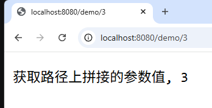
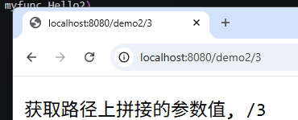
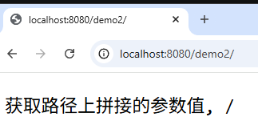
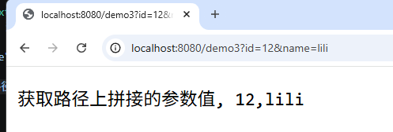
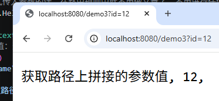
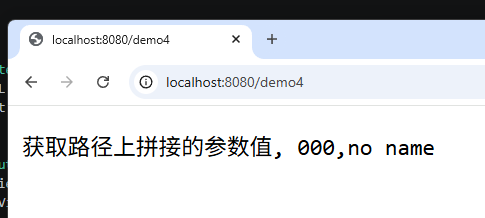
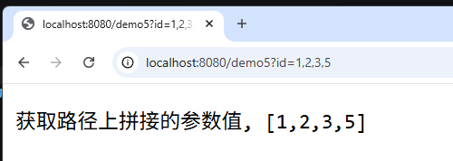
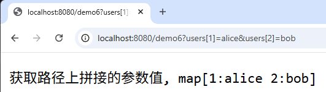

# GET方式

## 【1】带参数的路由：路径中直接加上参数
- 路径中加入参数值：`http://localhost:8080/demo/1001`

### 后端获取：
1. 方法1：使用占位符  `:`   
    ```Go
    func main() {
        r := gin.Default()

        //写路由：
        // 路由规则中要求你传入id的参数，那么就必须你在访问的时候必须传入参数值
        r.GET("/demo/:id", myfunc.Hello1)
        r.Run()
    }


    func Hello1(c *gin.Context) {
	    // 获取路径中的参数值
	    id := c.Param("id")
	    c.String(200, "获取路径上拼接的参数值, %s", id) //格式化方式拼接
    }
    ```    
    运行结果：   
       

    PS：方式1必须在路径给值才可以匹配到路径，否则报404错误找不到 `http://localhost:8080/demo/` 这样是找不到的！

2. 方式2：使用占位符*   
    路径中如果不给参数值，不报错404   
    ```GO
    func main() {
        r := gin.Default()

        //写路由：
        // 路由规则中要求你传入id的参数，那么就必须你在访问的时候必须传入参数值
        r.GET("/demo1/:id", myfunc.Hello1)
        // 如果利用*占位符，路径是否带参数就不重要了
        r.GET("/demo2/*id", myfunc.Hello2)

        r.Run()
    }

    func Hello2(c *gin.Context) {
        // 获取路径中的参数值
        id := c.Param("id")
        c.String(200, "获取路径上拼接的参数值, %s", id) // 能获取就给你拼接，没获取就算了
    }
    ```


    运行结果：   
    
    
---
## 【2】路径中使用键值对形式的参数
参数值以键值对的形式，通过?拼接到路径之后   
`http://localhost:8080/demo3?id=12&name=lili`   
利用?的形式拼接参数的键值对，多个键值对中间用&符号进行拼接   

### 后端获取：
1. `Query(key)`方法
```Go
// 如果路径中以键值对形式传入参数的话，在路由规则中就不用做文章了，不用进行任何操作
r.GET("/demo3", myfunc.Hello3)

func Hello3(c *gin.Context) {
	// 获取路径中的参数值：通过key获取对应的value
	id := c.Query("id")
	name := c.Query("name")

	c.String(200, "获取路径上拼接的参数值, %s,%s", id, name) // 能获取就给你拼接，没获取就算了
}

```

运行结果：
   

如果有没传入的参数，就获取不到数据  


2. `DefaultQuery(key, defaultVal)`
如果获取不到对应的数据，可以加入默认值 
```Go
// 如果路径中以键值对形式传入参数的话，在路由规则中就不用做文章了，不用进行任何操作
	r.GET("/demo4", myfunc.Hello4)


func Hello4(c *gin.Context) {
	// 获取路径中的参数值：通过key获取对应的value
	id := c.DefaultQuery("id", "000")
	name := c.DefaultQuery("name", "no name")

	c.String(200, "获取路径上拼接的参数值, %s,%s", id, name) // 没获取到的用默认值
}

```


---

## 【3】路径中参数值value为多个
1. 数组   
路径：`http://localhost:8080/demo5?id=1,2,3,5`  
```Go
r.GET("/demo5", myfunc.Hello5)

func Hello5(c *gin.Context) {
	// 获取路径中的参数值：通过key获取对应的value的多个参数
	idValues := c.QueryArray("id")

	c.String(200, "获取路径上拼接的参数值, %s", idValues) // 没获取到的用默认值
}

```
   
2. map 
路径：`http://localhost:8080/demo6?users[1]=alice&users[2]=bob`   
```Go
//map
	r.GET("/demo6", myfunc.Hello6)

func Hello6(c *gin.Context) {
	// 获取路径中的参数值：通过key获取对应的value的多个参数
	usersMap := c.QueryMap("users")

	c.String(200, "获取路径上拼接的参数值, %s", usersMap) // 没获取到的用默认值
}

```
   
