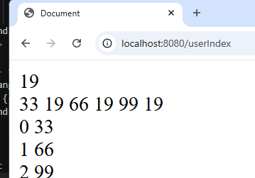
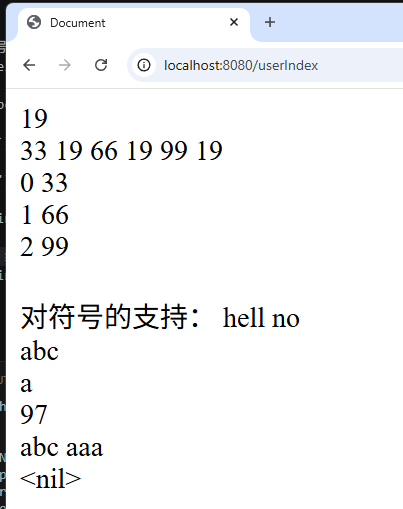
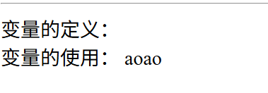

# 模板
## 基本语法
- 模板：在写动态页面的网站的时候，我们常常将不变的部分提出了成为模板，可变部分通过后端程序的渲染来生成动态网页，golang也支持模板渲染。
- 模板内内嵌的语法支持，全部需要加`{{}}`来标记
- 在模板文件内，`.`代表了当前位置的上下文：
    - 在非循环体内，`.`代表了后端传过来的上下文
    - 在循环体内，`.`代表了循环的上下文
- 在模板文件内，`$`代表了模板根级的上下文
- 在模板文件内，`$.`代表了模板根级的上下文

### 代码
- backend
```Go

func Hello(c *gin.Context) {
	// 定义数据
	age := 19
	arr := []int{33, 66, 99}
	// 将age和arr放入map中
	map_data := map[string]any{
		"age": age,
		"arr": arr,
	}
	c.HTML(200, "demo01/hello.html", map_data)
}
func main() {
	r := gin.Default()
	// 写路由
	// 加载html页面：
	r.LoadHTMLGlob("template/**/*")

	// 定义路由
	r.GET("/userIndex", myfunc.Hello)
	r.Run()
}

```

- frontend
```HTML
<body>
    
    {{/*获取后端传过来的map_data中的内容*/}}
    <!-- 通过key获取value -->
     <!-- .当前的上下文，后端传过来的map_data这个上下文 -->
    {{.age}} <br>
    <!-- .当前的上下文，后端传过来的map_data这个上下文 -->
    {{range .arr}}
        <!-- 这里的 . 上下文指的是 .arr这个上下文，指的就是遍历的每一个袁旭 -->
         {{.}}

         <!-- 在循环内部想获取根级上下文中的age的话，就需要使用$.来获取（map_data这个上下文） -->
          {{$.age}}
    {{end}}
    <br>

    <!-- $i, $v 后端传过来的map_data这个上下文中获取数据 -->
    {{range $i, $v := .arr}}
        {{$i}} {{$v}} <br>
    {{end}}
</body>
```

- result   


## 特殊符号的支持
- 字符串 ：`{{"hell no"}}`
- 原始字符串 ：{{\`abc\`}}  {{\`a\`}} 不会转义 会展示 a
- 字节类型 ：`{{'a'}}` --> `97` 会转义
- 打印：
    - 打印字符串: `{{print "abc aaa"}}`
    - nil类型：`{{print nil}}`   
- 代码
```HTML
    <br>
    对符号的支持：
    {{"hell no"}}
    <br>
    {{`abc`}}
    <br>  
    {{`a`}}
    <br>
    {{'a'}}
    <br>
    {{print "abc aaa"}}
    <br>
    <!-- 结果<nil> -->
    {{print nil}}  
```
- 结果：   



## 变量的定义和使用
- 代码
```HTML
    变量的定义：
    {{$name := "aoao"}} <br>
    变量的使用：
    {{$name}}
```
- 结果


## if的使用
- golang模板也支持`if`的条件判断，当前支持最简单的`bool`类型和字符串的判断
```HTML
{{if .condition}}
{{end}}
```
当`.condition`为`bool`类型时候，`true`执行；为`string`类型的时候，非空表示执行

- 也支持`else`，`else if`嵌套
```HTML
{{if .condition}}
{{else}}
{{end}}

{{if .condition1}}
{{else if .conditon2}}
{{end}}
```

- 支持嵌套使用
```HTML
{{if .condition}}
    {{if .innerCondition}}
    {{end}}
{{end}}
```

- 假设我们需要逻辑判断，比如与或，大小不等于等判断的时候，我们需要一些内置的模板函数
    - `not`
    - `and`
    - `or`
    - `eq`
    - `ne` - not equal
    - `lt` - less than
    - `le` - less equal
    - `gt` - greater than
    - `ge` - greater equal

## 循环的使用
- goland的template支持range循环遍历map，slice内的内容
```HTML
{{range $i, $v := .slice}}
{{end}}
```
在↑这个循环体内，可以通过$i,$v来访问遍历的值
- 另一种遍历
```HTML
{{range .slice}}
{{end}}
```
↑这个方法无法访问index或者key值，需要通过`.`来访问对应的value
```HTML
{{range .slice}}
{{.filed}}
{{end}}
```
- 访问外部变量：`$.`
```HTML
{{range .slice}}
{{$.ArticleContent}}
{{end}}
```
- `range`也支持`else`：长度为0时，执行`else`
```HTML
{{range .slice}}
    {{.}}
{{else}}
    ,,,  //当.slice为空 或这 长度为0 时就会执行这里
{{end}}
```

## with关键字
```HTML
{{with pipeline}} T1 {{end}}
{{with pipeline}} T1 {{else}} T0 {{end}}
```
其中pipeline为判断条件，如果满足就将 `.`设为pipeline的值并执行T1，不修改外面的`.` 否则执行T0
- 代码
```HTML
    <hr>
    获取结构体中内容： 
    {{.stu.Age}}  
    {{.stu.Name}}
    <br>
    启动with关键字
    <!-- 当含有.stu的内容，在这个with里可以直接用.替代 -->
    {{with .stu}}
        {{.Age}}{{.Name}}
    {{end}}
```

## template关键字
- hello.html
```HTML
  内嵌另外模板：
    <!-- 如果想要传递内容到内嵌模板中，可以通过.上下文进行传递，和内嵌页面共享上下文数据 -->
    {{template "template/demo01/hello2.html" .}}
```
- hello2.html
```HTML
{{define "template/demo01/hello2.html"}}
<!DOCTYPE html>
<html lang="en">
<head>
    <meta charset="UTF-8">
    <meta name="viewport" content="width=device-width, initial-scale=1.0">
    <title>Document</title>
</head>
<body>
    这是一个内嵌页面
    {{.stu.Age}} {{.stu.Name}}
</body>
</html>
{{end}}
```
---
# 模板函数
1. `print`     打印字符串
2. `printf`    按照格式化的字符串输出
    - 格式：参照：Go中：fmt.Sprintf
3. `len`       返回对应类型的长度(map, slice, array, string, char)
4. 管道传递符 `|`
    - 函数中使用管道传递过来的数值
5. 括号提高优先级别：`()`
```HTML
 模板函数：<br>
    {{print "nihao"}} <br>
    {{printf "name:%s, age: %d" "bob" 12}} <br>
    {{len .arr}} <br>
    {{"aoao" | printf "%s"}}  {{"aoao" | len}} <br>
    {{printf "name: %s, addr: %s" "cathy" (printf "%s-%s" "seattle" "washinton")}}

```
6. `and` 只要一个为空，整体为空；如果都不为空，返回最后一个
7. `or`  只要有一个不为空，则返回第一个不为空；如果都为空，返回空
8. `not` 用于判断返回布尔值，非逻辑
9. `index` 读取指定类型对应下标的值(map, slice, array, string)
```HTML
<!-- .age & .username 都不为空，所以返回后一个；.xxx为空，所以返回空 -->
    {{and .age .username}}
    {{and .username .age}}
    {{and .xxx .age}}
    <br>
    <!-- 返回第一个不为空 -->
    {{or .age .username}} 
    {{or .username .age}}
    {{or .xxx .yyy}}
    <br>
    <!-- 非逻辑，空则返回true -->
    {{not .age}}
    {{not .aaa}}
    <br>
    <!-- 字母会转化成ascii -->
    {{index "abcdefg" 4}}
    {{index .arr 0}}
```
10. `eq`
11. `ne`
12. `lt`
13. `le`
14. `gt`
15. `ge`
```HTML
    <br>
    {{eq 26 89}}
    {{ne 26 89}}
    {{lt 26 89}}
    {{le 26 89}}
    {{gt 26 89}}
    {{ge 26 89}}
```
16. 日期格式化 `Format`
- 实现了时间的格式化，返回字符串，设置时间格式比较特殊，需要固定方式，不能轻易改变
- 格式化时间可以在后端处理：
    - 指定格式
    ```Go
    datestr2 := now.Format("2006/01/02 15/04/05")
    fmt.Println(datestr2)
    // 选择任意组合都可以，按需设置
    datestr3 := now.Format("2006 15:04")
    fmt.Println(datestr3)
    ```
- 在前端处理
```HTML
<hr>
    获取后端的时间：
    {{.now_time.Format "2006-01-02 15-04-05"}}
```
17. 自定义模板函数
- 定义函数
```Go
// In user.go
// 定义一个函数:
func Add(num1 int, num2 int) int {
	return num1 + num2
}

```
- 注册函数
```Go
// In main.go
func main() {

	r := gin.Default()

	// 注册函数:FuncMap是html/FuncMap
	r.SetFuncMap(template.FuncMap{
		// 键值对的作用，key指定前端调用的名字，value指定后端对应的函数
		"add": myfunc.Add,
	})
	// 写路由
	// 加载html页面：
	r.LoadHTMLGlob("template/**/*")

	// 定义路由
	r.GET("/userIndex", myfunc.Hello)
	r.Run()
}

```
- 使用函数
```HTML
调用add函数
    {{add 1 3}}
```