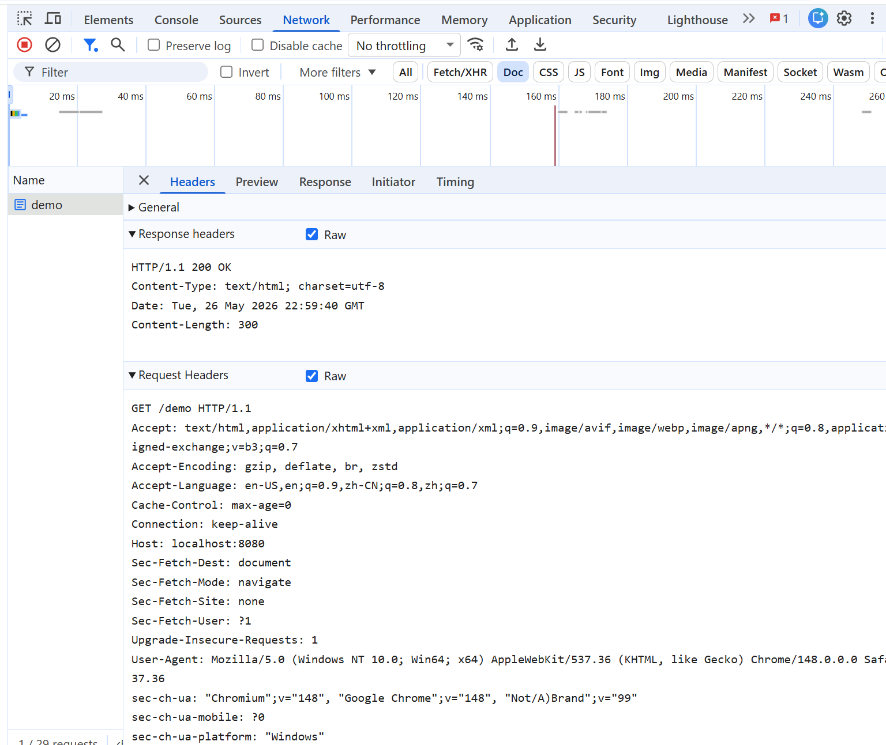
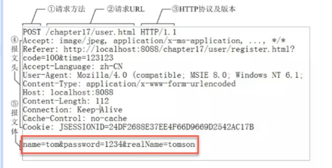
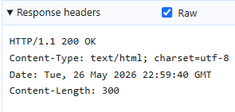
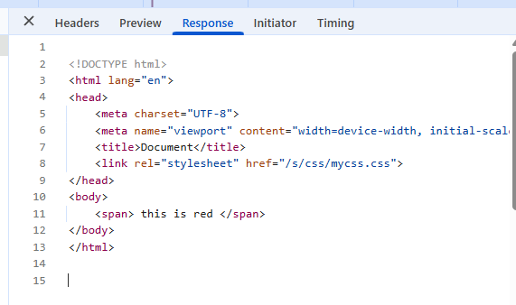

https://www.bilibili.com/video/BV1CV411P78J?spm_id_from=333.788.videopod.episodes&vd_source=95e010711fed90c1308d22313b50b336&p=3

## 第一个gin项目
1. 创建项目目录地址
2. 设置proxy：GoLang在GoModule里设置，vscode在cmd设置go env GOPROXY
3. 下载Gin框架：`go get -u github.com/gin-gonic/gin`
4. 配置file watcher （golang）自动导入啥的
5. 写代码，默认三步
```go
// 1. initialization
r := gin.Default() // get engine

// 2. register routes 挂载路由
r.GET("/index", Index) // same as http.HandleFunc

// 3. bind to a port, run
r.Run("127.0.0.1:8080") // same as http.ListenAndServer
```
6. 运行程序
7. 浏览器访问


## 4. 运行原理
### r := gin.Default()
- `Default()` 返回的是一个引擎，它是框架非常重要的数据结构，是框架的入口
- 引擎 - 框架核心发送机 - 默认服务器 - 整个web服务都是由它来驱动的
- Default()底层调用了New(), 相当于New()升级，New()返回的是一个引擎，在此基础上多增加了中间件处理-engine.Use(Logger(), Recovery())
- 可以用 gin.New() 替代


### r.GET("/", func(context *gin.Context){})
- 路由：通过访问“/”该路径的GET请求，走着一条处理逻辑，走对应函数中的内容
- “/”：路由规则     函数：路由函数
- 路由请求：GET。POST。DELETE。PATCH。PUT。HEAD。OPTIONS。ANY
- 函数：可以直接写匿名函数，还可以在外部定义函数使用
- `gin.Context`: 把请求和响应都封装到`gin.Context`上下文环境中
- func里：对页面的渲染效果（多种），你要给浏览器响应什么效果
- 函数：路径按照自己的项目规则去定义 "/xxx" "/yyy”

### r.Run()
- 启动引擎，服务器启动
- Run可以传入参数：host+port
- 中间拼接的冒号不要忘记

## 6.数据互动-使用模板文件渲染
1. `Engine`的`.LoadHTMLFiles`方法：(不推荐，因为要加载的文件太多的话要写很多路径文件名)
    - 加载子指定的模板文件
    - 不定长参数，可以传多个字符串，使用这个方法需要指定所有要使用的html文件路径

2. `Engine`的`.LoadHTMLGlob`方法 : （推荐
    - `func (engine *Engine) loadHTMLGlob(pattern string)`
    - 加载子文件夹下的模板文件
    - 只有一个参数，通配符，如：templates/*, 意思是找当前项目路径下templates文件夹下所有的html文件

3. 渲染HTML模板文件：Context的HTML方法：
    - 参数
        - 状态码：当浏览者访问一个网页时，浏览者的浏览器回想网页所在的服务器发出请求。当浏览器接收并显示网页前，此网页所在的服务器会返回一个包含HTTP状态码的信息头(server header)用以响应浏览器请求
            - http状态码详解：http://tool.oschina.net/commons?type=5
            - 1**: 信息，服务器收到请求，需要请求者继续操作
            - 2**：成功，操作被成功接收并且处理
            - 3**：重定向，需要进一步的操作以完成请求
            - 4**：客户端错误，请求包含语法错误或者无法完成请求
            - 5**：服务器错误，服务器在处理请求的过程中发生了错误
        - 渲染文件名
        - 传入参数：空接口可以接收任意类型

4. 多级目录的模板指定    
如果有多级目录，比如templates下有demo01和demo02两个目录，如果要使用里面的html文件，必须得在Load的时候指定多级才可以，比如`r.LoadHTMLGlob("templates/**/*")`   
    - 有几级目录，得在通配符上标明    
        `r.LoadHTMLGlob("templates/**/*")`
    - 指定html文件，处理第一级的templates路径不需要指定，后面的路径都要指定     
        ```go
        // params: 状态码，渲染文件名, 空接口可以接受任意类型
        c.HTML(200, "demo01/hello01.html", nil)
        ```
    - 在html中define定义目录    
        `{{define "demo01/hello01.html"}}`    
        `{{end}}`

## 7.数据互动-使用静态文件
[1] 指定静态文件的路径
1. 方式1：
    `func (group *RouterGroup) Static(relativePath, root string) IRoutes{}`
    - 第一个参数：相对路径
    - 第二个参数：文件夹名称s
    - 含义：这个相对路径映射到哪个文件夹上去   
        `r.Static("/s", "/static") // 用‘/s'来替代 /static路径`   
2. 方式2：
    `func (group *RouterGroup) StaticFS(relativePath, fs http.FileSystem) IRoutes{}`    
    `r.StaticFS("/s", http.Dir("static"))`    
[2] 在前端页面引入静态文件：
    `<link rel="stylesheet" href="/s/css/mycss.css">`

## 8.项目结构调整
【1】单独将函数部分提取：
创建文件夹 - 创建go文件-将函数放入   

【2】在main.go中调用即可
    `myfunc.go`


## 9.数据交互-后端数据给前端-不同类型渲染入页面

### 渲染字符串类型
【1】将要渲染的字符串通过`c.HTML(code, name, interface)`第三个参数传入   
```Go
name := "hello iam aoao"
c.HTML(200, "demo01/hello01.html", name)
```

【2】在页面上利用上下文来获取：   
PS: .代表的就是上下文中你传入的name
`{{.}}`

### 渲染结构体类型
【1】将要渲染的结构体通过`c.HTML(code, name, interface)`第三个参数传入   
```Go
type Student struct {
	Name string
	Age  int
}

func Hello2(c *gin.Context) {
	// 创建结构体实例
	s := Student{
		Name: "aoao",
		Age:  4,
	}
	c.HTML(200, "demo01/hello01.html", s)
}
```

【2】在页面上利用上下文来获取：   
`{{.Name}}<br>{{.Age}}`   

上面的案例传入的是一个结构体实例，以后可能会传入多个结构体，--> 后续利用map来处理


### 渲染数组类型
【1】将要渲染的结构体通过`c.HTML(code, name, interface)`第三个参数传入   
```Go
func Hello3(c *gin.Context) {
	// 定义一个数组：
	var arr [3]int
	arr[0] = 10
	arr[1] = 20
	arr[2] = 30

	c.HTML(200, "demo01/hello01.html", arr)
}
```
【2】在页面上利用上下文来获取：   
```html
    {{/*这是第一种方式：第一个.代表的是传入的数组的上下文; 第二个.代表遍历的数组的上下文*/}}
    {{/*range . 里的 .	整个数组 arr；      range 内部的 .	当前元素 item*/}}
    {{range .}}
        {{.}}
    {{end}}

    {{/*这是第二种方式：$i-index，$v-value*/}}
    {{range $i,$v := .}}
        {{$i}}
        {{$v}}
    {{end}}
```  


### 渲染结构体数组类型
【1】将要渲染的结构体通过`c.HTML(code, name, interface)`第三个参数传入   
```Go
func Hello4(c *gin.Context) {
	// 定义一个结构体类型的数组：
	var arr [3]Student
	arr[0] = Student{
		Name: "alice",
		Age:  1,
	}
	arr[1] = Student{
		Name: "bob",
		Age:  2,
	}
	arr[2] = Student{
		Name: "cathy",
		Age:  3,
	}
	c.HTML(200, "demo01/hello01.html", arr)
}
```
【2】在页面上利用上下文来获取：   
```HTML
  {{/*这是第一种方式：第一个.代表的是传入的数组的上下文; 第二个.代表遍历的数组的上下文, 代表每一个结构体实例*/}}
    {{/*range . 里的 .	整个数组 arr；      range 内部的 .	当前元素 item*/}}
    {{range .}}
        {{.Name}}
        {{.Age}}
        <br>
    {{end}}

    {{/*这是第二种方式：$i-index，$v-value,如果只用$v接收也是可以的*/}}
    {{range $i,$v := .}}
        {{$i}}：
        {{$v.Name}}-{{$v.Age}}
        <br>
    {{end}}
```

### 渲染map类型
【1】将要渲染的结构体通过`c.HTML(code, name, interface)`第三个参数传入   
```Go
func Hello5(c *gin.Context) {
	// 定义一个Map
	var a map[string]int = make(map[string]int, 3)
	//将键值对存入map
	a["alice"] = 1
	a["bob"] = 2
	a["cathy"] = 3
	c.HTML(200, "demo01/hello01.html", a)
}
```
【2】在页面上利用上下文来获取：  
```HTML
    {{/*获取map中内容，通过key获取value值， .代表上下文中的map*/}}
    {{.alice}}<br>
    {{.bob}}

    {{查看所有key & value}}
    {{range $key, $value := .}}
        key: {{$key}} value: {{$value}} <br>
    {{end}}
```

### 渲染多个结构体类型
【1】解决：将多个结构体类型存入Map中：   

【2】将要渲染的结构体通过`c.HTML(code, name, interface)`第三个参数传入   
```Go
func Hello6(c *gin.Context) {
	// 定义一个Map
	var a map[string]Student = make(map[string]Student, 3)
	//将键值对存入map
	a["no1"] = Student{
		Name: "alice",
		Age:  1,
	}
	a["no2"] = Student{
		Name: "bob",
		Age:  2,
	}
	a["no3"] = Student{
		Name: "cathy",
		Age:  3,
	}
	c.HTML(200, "demo01/hello01.html", a)
}
```

【3】在页面上利用上下文来获取：  
```HTML

    {{/*.代表上下文Map，通过key得到value*/}}
    {{.no1.Name}} = {{.no1.Age}} <br>
    {{.no2.Name}} = {{.no2.Age}} <br>
    {{.no3.Name}} = {{.no3.Age}} <br>
```

### 渲染切片类型
【1】将要渲染的结构体通过`c.HTML(code, name, interface)`第三个参数传入   
```Go
func Hello7(c *gin.Context) {
	// 创建切片
	slice := []int{1, 2, 3, 4, 5, 6}
	c.HTML(200, "demo01/hello01.html", slice)
}
```
【2】在页面上利用上下文来获取：  
和数组的一模一样


## HTTP请求和响应  
【1】本质：   
Web是基于HTTP协议进行交互的应用网络   
Web就是通过使用浏览器/APP访问服务器的各种资源   
请求和响应查看：浏览器：f12   
【2】数据请求方式的分类：
所有的项目中使用的请求都遵循HTTP协议标准，HTTP协议经过了1.0和1.1两个版本的发展
- HTTP1.0定义了三种请求方法：GET，POST和HEAD方法
- HTTP1.1新增了五种请求方法：OPTIONS，PUT，DELETE，TRACE和CONNECT方法
因此，我们可以说，HTTP协议一共定义了八种方法用来对Requtest-URI网络资源的不同操作方式。   
这些操作具体为：`GET`, `PUT`, `POST`, `DELETE`, `HEAD`, `OPTIONS`, `TRACE`, `CONNECT` 等八种操作方式   
【3】Gin框架中包含多个方法，用来支持对上述HTTP多种请求类型的直接处理，直接定义为get方法，post方法等   
PS: 开发中用的最多的就是get，post请求方式

### HTTP请求
【1】打开f12 
Network -> Heaaders -> Raw   

【2】HTTP请求包含   
- Request消息分为3部分
    1. Request line：
        - 请求行：请求方式（默认GET）+ 资源路径 + 请求使用的协议    
            ` GET /demo HTTP/1.1`
    2. Request header：
        - 请求头用于说明是谁或什么在发送请求，请求源于何处，或者客户端的喜好及能力。服务器可以根据请求头部给出的客户端信息，试着为客户端提供更好的响应。请求头中信息的格式为 `key:value` （键值对）。不一定全部显示，因为有的是在特定情况才有，了解即可：
        - `Host`：客户端指定自己像访问的WEB服务器的域名/ip地址和端口号
        - `Connection`: 连接方式。如果是close则表示基于短连接方式，如果该值是`keep-alive`，网络连接就是持久的，在一定时间范围内是不会关闭，使得对同一个服务器的请求可以继续在该链接上完成
        - `Upgrade-Insecre-Requests`: 服务端是否支持https加密协议
        - `Cache-Control`: 指定请求和响应遵循的缓存机制
        - `User-Agent`: 浏览器表明自己的身份(是哪种浏览器)。例如Chrome浏览器：Mozilla/5.0(Windows NT 10.0; Win64; x64) AppleWebKit/537.36 （KHTML, like Gecko) Chrome/81.0.4044.129 Safari/537.36
        - `Accept`: 告诉Web服务器自己接收什么介质类型，`*/*`表示任何类型，`type/*`表示该类型下的所有子类型。
        - `Accept-Encoding`: 浏览器申明自己接收的编码方法，通常指定压缩方法，是否支持压缩，支持什么压缩方法(gzip, defalte)
        - `Accept-Language`: 浏览器什么自己接收的语言。语言和字符集的区别：中文是语言，中文有多种字符集，比如big5，gb2312，gbk等
        - `Accept-Charset`: 浏览器告诉服务器自己能接收的字符集
        - `Referer`: 浏览器向web服务器表面自己是从哪个网页URL获得点击当前请求种的网址URL
        - `Refresh`: 表示浏览器应该在多少时间之后刷新文档，以秒计时。
        - `Cookie`：可向服务端传递数据的一种模型
    3. Request body：
        - 客户端传递给服务器的数据。比如：表单使用post方式提交的数据，上传的文件数据等
        - 如果使用get方式请求，数据直接放在URL地址后，不会显示请求体 `xxx?key=val&key=val`
        - 如果使用post方式请求，请求体种才会有数据    
        


### HTTP响应
- Response包含
    1. 响应行：响应使用的协议 + HTTP响应状态码（它以清晰明确的语言告诉客户端本次请求的处理结果）
        `HTTP/1.1 200 OK`   
    
    2. 响应头：反馈给浏览器的信息
        - 响应头用于告知浏览器当前响应中的详细信息，浏览器提供获取响应头种的信息可以知道应该如何处理响应结果
        - 响应头种信息的格式为`key:value`（键值对格式
        - `Date`: 响应的Date使用的是GMT时间格式，表示响应消息送达时间
        - `Server`: 服务器提供这个Server告诉浏览器服务器的类型
        - `Vary`: 客户端缓存机制或者是缓存服务器在做缓存操作的时候，会用到vary头，会读取响应头中的Vary的内容，进行一些缓存的判断
        - `Content-Encoding`: 文档的编码（Encode）方式，用gzip压缩文档能够显著地减少HTML文档的响应时间
        - `Content-Length`: 表示内容长度，只有当浏览器使用持久HTTP链接时才需要这个数据
        - `Content-Type`: 表示响应的文档属于什么MIME类型
    3. 响应体   
    

#### 扩展了解：响应状态码
#### 扩展了解：MIME类型

